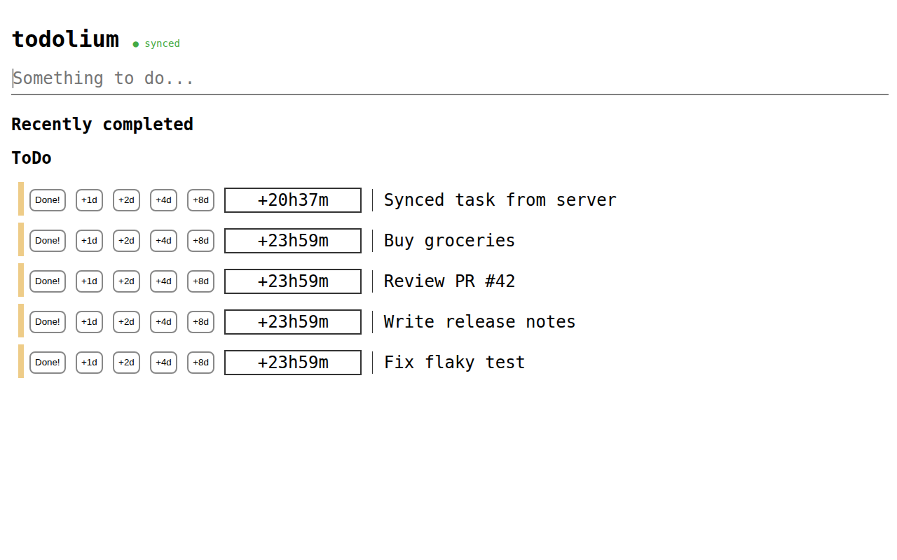
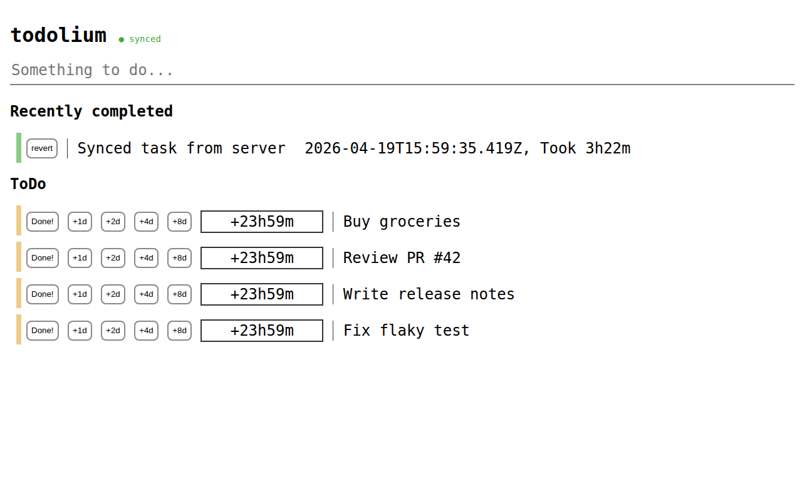

# todolium

A personal ToDo manager built on event sourcing. Works offline using browser localStorage, and optionally syncs with a server for persistence and multi-device access.

## Screenshots





## How to use

Type a task into the input box and press **Enter** to add it to your list.

Each task shows:
- **Done!** — mark the task complete
- **+1d / +2d / +4d / +8d** — postpone the deadline by that many days
- A duration indicator showing how much time is left (red background = overdue)

In the "Recently completed" section, **revert** moves a task back to ToDo with its original deadline restored.

## Running the server

The server stores events in `events.jsonl` and serves the web UI.

```
npm install
npm run build
npm start
```

The server listens on port 3000 by default. Set `PORT` to change it.

> **Note:** If you have a `todo.json` from an older version of todolium, remove or rename it before starting — the server will refuse to start if it exists.

## Using without a server (GitHub Pages / offline mode)

The static build under `dist/` works entirely in the browser using localStorage. No server needed. Tasks are stored locally in your browser and survive page refreshes.

Deploy `dist/` to any static host (GitHub Pages, Netlify, etc.) and it works out of the box.

## Development

```
npm test          # compile TypeScript and run unit tests
npm run build     # compile + assemble dist/ for static deployment
npm start         # run the server (requires a prior build)
```

TypeScript source lives in `src/`. The engine and tests compile to `generated/src/`.

## Mental model

### Events, not state

todolium never mutates a record in place. Every action — adding a task, postponing it, marking it done, reverting it — appends an immutable **event** to a log. The current UI state is derived by replaying that log from scratch each time.

Each event looks like:

```json
{
  "eid": "uuid",
  "type": "add_todo",
  "at": 1713532800000,
  "device_id": "uuid",
  "task_id": "uuid",
  "parent_eid": null,
  "task": "Buy groceries"
}
```

| Field | Meaning |
|---|---|
| `eid` | Unique ID for this event |
| `type` | `add_todo`, `postpone`, `mark_done`, `revert`, `edit_task` |
| `at` | Client timestamp (ms since epoch) |
| `device_id` | Anonymous UUID stored in localStorage, stable per browser |
| `task_id` | Groups all events that belong to the same task |
| `parent_eid` | The event this one follows (forms a chain per task) |

### Chains and conflict resolution

Events for each task form a **linked chain** via `parent_eid`. When two devices make conflicting changes (e.g., both postpone the same task while offline), a fork appears in the chain:

```
add_todo → postpone(A) → mark_done   ← wins (newer at)
                ↘ postpone(B)         ← discarded
```

Resolution rule: at each fork, the branch with the **newer `at` timestamp** wins. The losing branch and all its descendants are discarded. This makes conflicts deterministic and automatic — no manual merge required.

### Offline-first sync

The client stores all events in `localStorage` and derives state locally on every action. No network request is needed to use the app.

When a server is reachable, the client syncs every 5 seconds:

1. `GET /api/events` — fetch all server events
2. Merge with local events (union + fork resolution)
3. `POST /api/events` — send any events the server doesn't have yet
4. Save merged result to localStorage and re-render

The sync indicator in the heading shows **● synced** (green) when the last sync succeeded, and **○ offline** (grey) otherwise. The app remains fully functional either way.

### Server storage

The server appends events to `events.jsonl`, one JSON object per line. Events are never modified or deleted. The server deduplicates by `eid` before appending, so posting the same event twice is safe.
